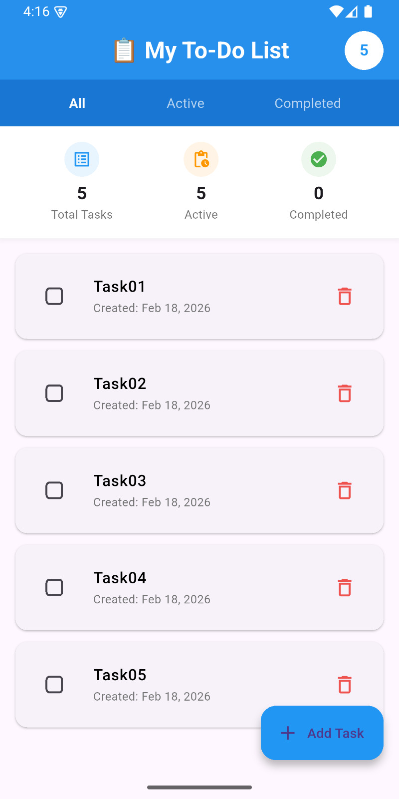
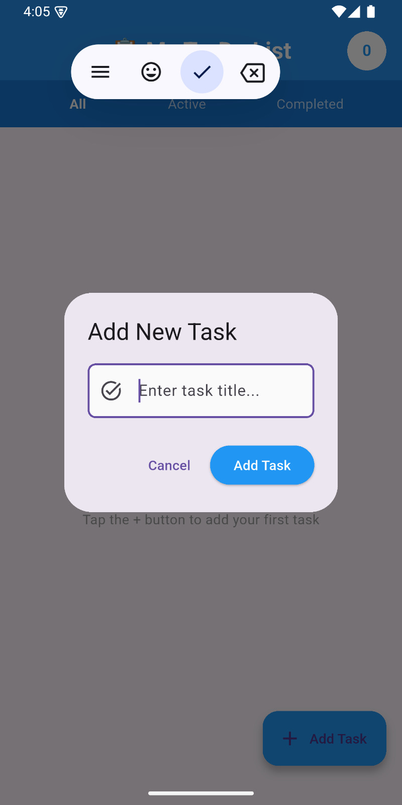
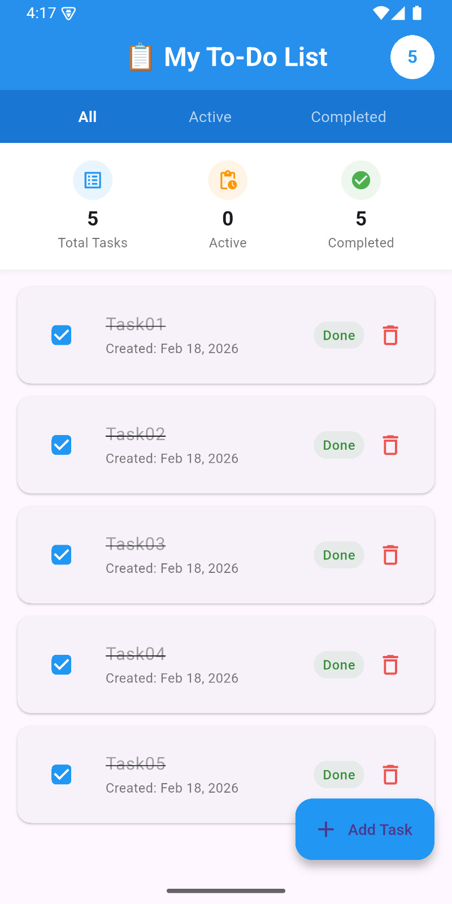
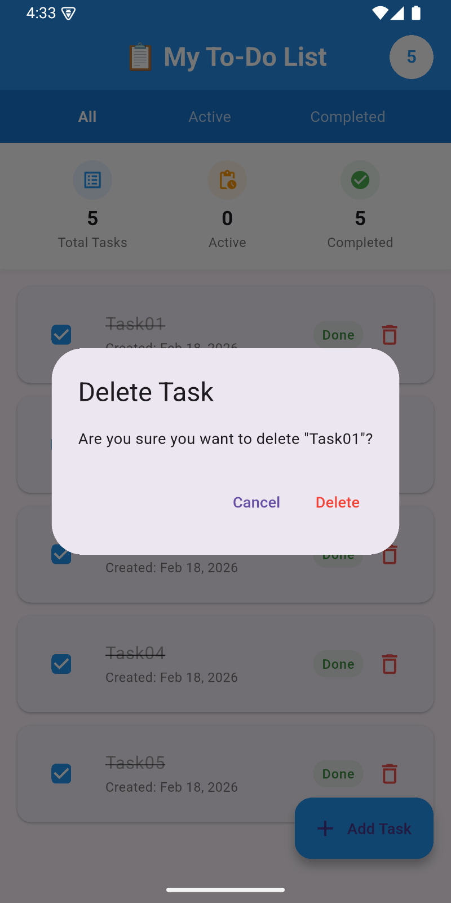

# Flutter To-Do List Application

A simple and elegant To-Do List application built with Flutter that allows users to manage their daily tasks efficiently.

## Features

-  Add new tasks with title
-  View tasks in a scrollable list
-  Mark tasks as complete/incomplete
-  Delete tasks
-  Local data persistence after app closure

## Group Members

| S/N | Name | Registration Number |
|-----|------|-------------------|
| 1 | HAGAI JOHN MKAWE | 30831/T.2023 | 
| 2 | BRITNEY BROWN NORMAN | 30297/T.2023 | 
| 3 | EDMUND WILLIAM RWEGASIRA | 31239/T.2023 | 
| 4 | REAGAN CHARLES REUBEN | 30489/T.2023 | 
| 5 | FARIJALA YAHAYA SAMBAYA | 31148/T.2023 | 
| 6 | MESHACK YUSUPH MPENDA | 32001/T.2023 | 

## Screenshots

### Main Screen

### Adding a Task

### Completing a Task

### Deleting a Task

##  How to Run the App

###  Prerequisites
- Flutter SDK (version 2.19.0 or higher)
- Android Studio or VS Code with Flutter extensions
- Git
- Android Emulator or Real Phone

###  Steps to Run

1. Clone the repository
git clone https://github.com/neyrren/flutter-todo-app.git

cd flutter-todo-app

2. Install dependencies
flutter pub get

3. Check Flutter setup
flutter doctor

4. Start emulator or connect phone
flutter devices

5. Run the app
flutter run
